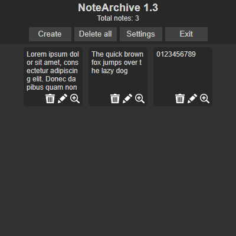
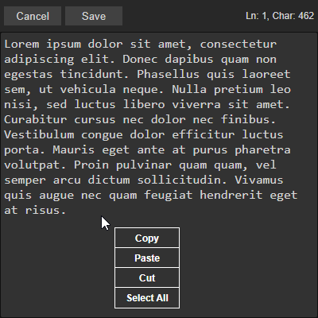

# What is NoteArchive?
NoteArchive is an extension for Google Chrome, Opera where you can create, edit, delete notes. The extension is still under development, please let me know if you find any bugs.

# How do I install the extension?
You can download the extension in the release section.

1)Open Chrome or Opera: Ensure you have the Chrome or Opera browser open.

2)Go to Extensions Page:
- For Chrome: Enter chrome://extensions in the address bar.
- For Opera: Enter opera://extensions in the address bar.

3)Enable Developer Mode: On the Extensions page, toggle the switch for Developer mode in the top-right corner.

4)Unzip the Extension: If your extension is in a zipped archive, extract the contents to a folder on your computer.

5)Load Unpacked Extension:
- Click the Load unpacked button.
- Navigate to the directory where you extracted the extension.
- Select the folder and click Select Folder (or Open).
  
# What's in here?
When you first open the extension, you'll see a button on the bottom left to add a new note. 
On the top right you will see a counter for your notes. And on the top left you will see 
the name of the extension and the current version.

Still at the top you will see 4 buttons.

- Create: creates a new note
- Delete All: deletes all notes
- Settings: opens settings
- Exit: closes the extension

When you click the create button, you will open the built-in editor where there is a line 
counter, character counter and two buttons to save, exit and input field.Just type the text 
in the input box and click save to save the note. If you want to exit without saving, press 
exit. *In this case the data will not be saved.

There are 2 parameters in the settings. The first one sets the size of the text in the editor. Write any value in pixels there. The second parameter is responsible for word transposition in the editor.

Each note has 3 buttons. 

- View
- Edit
- Delete

If you click on the view button, it will open the note view window where you can view the whole text. If you click on the edit button, the editor opens where you can edit the text. To delete a note, click the delete button.

# Working with the context menu

In edit mode, you can open the context menu by right-clicking anywhere in the input field. It has several functions:

- Copy
- Paste
- Cut
- Select All

To select a function, simply click on it in the context menu. Click anywhere to close the context menu.
